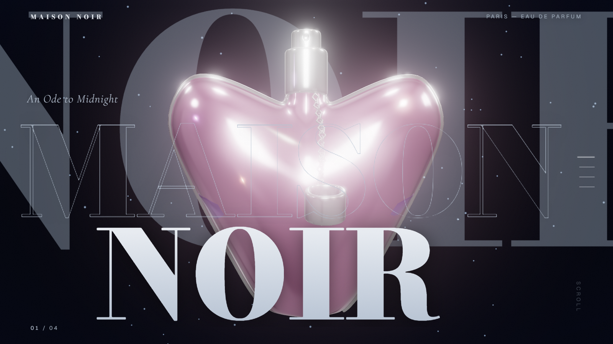

# Maison Noir — Élixir Noir

A cinematic, scroll-driven 3D perfume showcase. A heart-shaped rose-glass bottle rendered in real-time WebGL, choreographed across four scroll beats with giant editorial typography.

**Live:** [perfume-product-tawny.vercel.app](https://perfume-product-tawny.vercel.app/)



## The experience

1. **Hero** — the bottle rises through viewport-filling MAISON / NOIR display type
2. **Élixir Noir** — the bottle drifts right as the name bleeds in from the left edge
3. **Composition** — camera dollies close; Top / Heart / Base notes reveal as an editorial list, with a giant "NOIR" *physically refracting through the glass* on an in-scene type plane
4. **Discover** — a full 360° turn under a rim-light halo, into the CTA

Plus: branded preloader with real load progress, custom dot-and-ring cursor, magnetic CTA, pointer-parallax camera, film grain, floating dust particles, and a scroll-progress hairline with clickable section markers.

## Tech

| Layer | Choice |
|---|---|
| Framework | Next.js 16 (App Router, Turbopack) + React 19 + TypeScript |
| 3D | Three.js (vanilla) — `GLTFLoader`, `MeshPhysicalMaterial` transmission glass, `EffectComposer` + `UnrealBloomPass`, in-scene `CanvasTexture` type plane |
| Animation | GSAP ScrollTrigger (one scrubbed master timeline) + `@gsap/react` |
| Scroll | Lenis, driven from the GSAP ticker (single unified loop) |
| Styling | Tailwind v4 + a token-driven theme system (midnight-platinum / oxblood, switchable in `lib/palette.ts`) |

### Architecture notes

- The bottle sits in a `pivot → spinner → model` group hierarchy: GSAP owns the pivot (scroll choreography), the render loop owns the spinner (idle spin + bob) — transforms compose, so they never fight.
- The canvas is opaque and `position: fixed`; the background gradient lives *in-scene* (bloom doesn't preserve canvas alpha).
- Mobile gets a dedicated performance path: half-resolution transmission, no bloom, smaller textures, solid scrims instead of backdrop blur, and a smaller bottle scale for portrait framing.

## Run locally

```bash
npm install
npm run dev
# → http://localhost:3000
```

Build: `npm run build` · Lint: `npx eslint .`

## Credits

Perfume bottle model via Sketchfab (glTF 2.0), served from `public/models/perfume.glb`.
